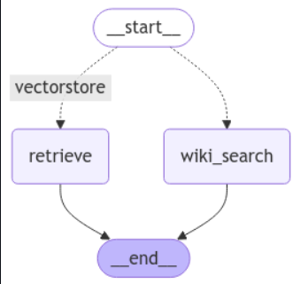

# End-to-End Multi-AI Agentic RAG Chatbot using LangGraph and AstraDB

## Overview
This project demonstrates the creation of a Retrieval-Augmented Generation (RAG) chatbot leveraging multiple AI agents, LangGraph, and AstraDB as the vector database. Follow the steps below to set up and run the application.

---
## application flow

## Steps to Run

### 1. **Create a Groq Cloud Account and API Token**
   - Go to the [Groq Cloud Console](https://console.groq.com/keys).
   - Create an account (if you don’t already have one).
   - Generate an API token and keep it secure.

### 2. **Set Up AstraDB Instance**
   - Go to [DataStax Astra](https://astra.datastax.com).
   - Create an account (if not already registered).

   #### Steps to Create a Serverless Vector Database:
   a. Click on **Create Database**.

   b. Select **Serverless Vector Database**.

   c. Choose a **Cloud Provider** and a **Region** that suits your needs.

   d. Complete the database creation process.

   
   #### Steps to Generate Application Token:
   e. Navigate to the **Database Settings**.

   f. Create a token for your database.

   g. Store the **Application Token** and **Database ID** as environment variables:

      - `ASTRA_DB_APP_TOKEN`

      - `ASTRA_DB_ID`

### 3. **Set Up the Environment**
   - Install the required dependencies using the following command:
     ```bash
     pip install -r requirements.txt
     ```
   - Create a `.env` file to store the following variables:
     ```env
     GROQ_API_KEY=<your_groq_api_key>
     ASTRA_DB_APP_TOKEN=<your_astra_app_token>
     ASTRA_DB_ID=<your_astra_db_id>
     ```

### 4. **Execute the Jupyter Notebook**
   - Open the source code in Jupyter Notebook or create a `.ipynb` file.
   - Execute each cell in the notebook sequentially.
   - The notebook includes code for:
     - Loading and embedding documents.
     - Configuring LangGraph for multi-agent integration.
     - Setting up and querying AstraDB as the vector database.

### 5. **Run the Application**
   - After executing the final cell, the chatbot application will start.
   - Use the provided chatbot interface to interact with the RAG model.

---

## Key Features
- **Multi-Agent Integration:** Utilizes multiple AI agents for enhanced query understanding and response generation.
- **RAG Framework:** Combines retrieval-based and generative AI capabilities.
- **LangGraph:** Facilitates orchestration of multiple agents within the chatbot pipeline.
- **AstraDB:** Efficient vector database for document embeddings and similarity search.

---

## Prerequisites
- Python 3.8 or higher.
- Jupyter Notebook installed on your system.
- Active accounts on Groq Cloud and DataStax Astra.
- Necessary API tokens and database credentials.

---

## Example Usage
Once the application is running, you can interact with it by entering natural language queries. The chatbot will retrieve relevant information from the vector database and provide coherent responses.

---

## Additional Notes
- Ensure all dependencies are correctly installed before running the notebook.
- Use secure methods to store your API tokens and database credentials.
- Test the application with different query scenarios to understand its capabilities.

---

## Conclusion
This project showcases the implementation of a cutting-edge RAG chatbot with multi-agent support, integrated using LangGraph and AstraDB. By following the steps outlined above, you can replicate the setup and explore its functionality for various applications.

---

### Repository Structure
```plaintext
.

├── .env                # Environment variables file

├── requirements.txt    # Python dependencies

├── README.md           # Project documentation

├── chatbot.ipynb       # Jupyter Notebook for the chatbot

```
Feel free to explore and expand the project to suit your use case.
